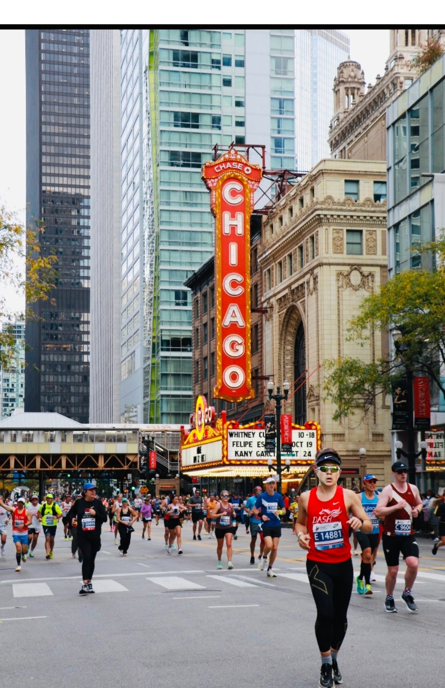
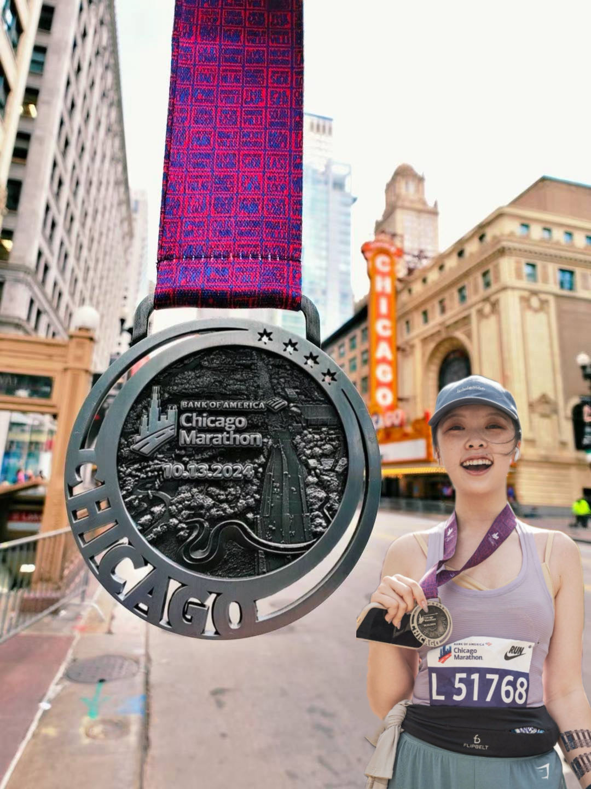
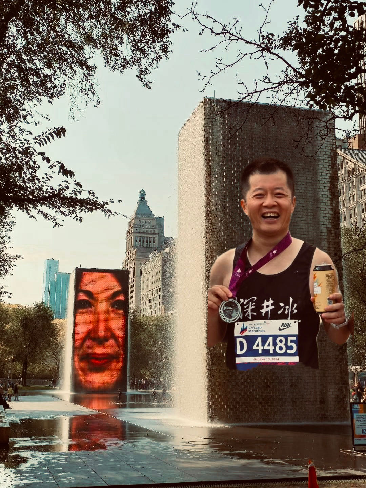

芝加哥馬拉松作為世界六大馬拉松賽事之一，一直以來都備受矚目。今年，我有幸與島哥和Laura一同踏上了這場盛大的跑步盛宴。

溫哥華跑友在本次賽事中表現出色，不少人都交出了令人欣喜的成績單。其中，Eric Duan以2小時45分鐘的佳績脫穎而出，而眾多女選手也展現了驚人的實力。

今年的賽事更是見證了一個歷史性的時刻。來自肯亞的Ruth Chepngetich以驚人的2小時09分56秒的成績摘得女子組桂冠，不僅打破了女子馬拉松世界紀錄，更成為首位突破2小時10分大關的女子馬拉松選手。值得一提的是，目前男女馬拉松的世界紀錄均誕生於芝加哥馬拉松賽道,充分證明了這條賽道的卓越品質,為跑者創造佳績提供了絕佳的舞台。

儘管我個人的表現未能達到預期，但整個旅程依舊精彩紛呈，充滿歡樂，特別分享此次芝加哥之行中，除了跑步之外的種種體驗與心得。

## 芝加哥的交通
從機場到市區最方便的方式是乘坐CTA的Blue Line機場線，day pass是5美金，可以乘坐公交和CTA。可以下載ventra app，註冊後直接購買，免去排隊。這裡注意的是CTA和Metra不一樣，CTA是公交，Metra是火車。我們這次去Expo座的是Metra，結果以為買了day pass不需要再買票，結果被查票的查了，還好只有兩站地，查票的也沒有罰款。

## 位置最佳的酒店

位置最好的酒店是Hilton，就在賽道旁邊，步行到達起點，距離終點也很近。

HILTON CHICAGO - HEADQUARTER HOTEL
720 S Michigan Ave
Chicago, IL 60605
Phone: 312-922-4400
Fax: 312-922-5240

要訂這個酒店需要提前很久，我是2023年10月就訂了，提前了1年多。每晚的價錢350美金，加上其他的稅，最後每晚上400多美金。一個房間可以最多住4個人，所以如果4個人一起住，每個人分攤下來也就100多美金。

## 推薦的飯店

以下是一些值得推薦的芝加哥餐廳：

1. 明軒（Minghin Cuisine）：粵菜連鎖店，位置便利，價格合理。
   - 地址1：1234 S Michigan Ave, Chicago, IL 60605
   - 地址2：333 E Benton Pl #300, Chicago, IL 60601
2. Au Cheval：以漢堡聞名的美式餐廳，常常排隊。
   - 地址：800 W Randolph St, Chicago, IL 60607
3. Girl & the Goat：創意美式料理，需提前預訂。
   - 地址：809 W Randolph St, Chicago, IL 60607
4. Lou Malnati's Pizzeria：芝加哥深盤披薩的代表之一。
   - 多個分店，市中心位置：805 S State St, Chicago, IL 60605
5. Portillo's：芝加哥風味的熱狗和意大利牛肉三明治。
   - 地址：100 W Ontario St, Chicago, IL 60654
6. The Purple Pig：地中海風味餐廳，以小吃和葡萄酒聞名。
   - 地址：444 N Michigan Ave, Chicago, IL 60611

這些餐廳涵蓋了不同的口味和價位，從當地特色到國際美食，相信能滿足不同跑者的需求。建議根據個人喜好和位置選擇，並在繁忙時段提前預訂。

明軒（Minghin Cuisine）是以前跑過芝加哥的前輩推薦的飯店，在Hilton附近走路能到達。週六我們總共去了三次，早、中、晚，最後我們都感覺有點補碳過份了。不過味道還是挺好的，價錢也不貴，三個人吃一頓飯人均25-30美金。

## 推薦的活動
芝加哥除了马拉松比赛外，还有许多值得体验的活动。以下是一些推荐：
1. 建筑游船之旅：芝加哥以其独特的建筑风格而闻名。乘坐游船沿着芝加哥河欣赏城市天际线，是了解这座城市历史和建筑的绝佳方式。DuSable Bridge邊上可以參加Wendella Tours & Cruises的遊船。購買的連結：（https://www.wendellaboats.com/Boat-Tours/chicagos-original-architecture-tour/）
2. 参观艺术博物馆：芝加哥艺术博物馆是世界上最大的艺术博物馆之一，收藏了大量印象派和后印象派作品。
3. 登顶威利斯大厦：在这座108层高的摩天大楼顶部的观景台，可以360度俯瞰整个芝加哥。
4. 千禧公园散步：这个现代化的城市公园融合了艺术、建筑和绿色空间，是放松身心的好去处。
5. 品尝深盘披萨：芝加哥以其独特的深盘披萨而闻名，不妨尝试一下这道当地特色美食。
6. 观看体育比赛：如果时间允许，可以考虑观看一场芝加哥公牛队的篮球比赛或芝加哥小熊队的棒球比赛。

这些活动不仅能让你更深入地了解芝加哥，还能帮助你在马拉松后放松身心，充分享受这座城市的魅力。而芝加哥的幾個地標都在Hilton附近，步行即可到达：

1. 云门(Cloud Gate)：又称"豆子"，位于千禧公园，是芝加哥的标志性雕塑。
   - 地址：201 E Randolph St, Chicago, IL 60602
   - 步行距离：约10分钟
2. 皇冠喷泉(Crown Fountain)：互动视频雕塑，同样位于千禧公园。
   - 地址：201 E Randolph St, Chicago, IL 60602
   - 步行距离：约10分钟
3. 芝加哥艺术博物馆(Art Institute of Chicago)：世界顶级艺术博物馆之一。
   - 地址：111 S Michigan Ave, Chicago, IL 60603
   - 步行距离：约5分钟
4. 白金汉喷泉(Buckingham Fountain)：格兰特公园内的大型喷泉。
   - 地址：301 S Columbus Dr, Chicago, IL 60605
   - 步行距离：约7分钟
5. 密歇根大道(Michigan Avenue)：著名的购物街，又称"壮丽一英里"。
   - 位置：就在希尔顿酒店门口
6. 芝加哥河步道(Chicago Riverwalk)：沿芝加哥河的休闲步道。
   - 起点：Lake Shore Dr & E Wacker Dr, Chicago, IL 60601
   - 步行距离：约15-20分钟

另外還可以去耐克旗艦店，對面四層樓的星巴克Starbucks Reserve Roastery，都不是太遠。

## 經典相片

跑芝加哥最經典相片是背景有Chicago標誌的劇院，垂直标志上用发光的槽形字母拼出“CHICAGO”字样，是芝加哥市的象征，也是美国少数仍在使用的原始外露灯泡电灯招牌之一。這次只有跑得比較快的Eric收穫了一張經典相片，不過在KK的幫助下，我們每個人都收穫了一張。

這大概是今年最佳的相片，黑人大哥的表情太搞笑了。

我們其他人雖然沒有像Eric那樣跑得快，但是在KK的幫助下，也各都收穫了一張經典難忘的相片。

## 感謝

印象深刻的是芝加哥的chi跑團組織的非常好，從賽前的補碳會、賽中的義工組織和賽後的相片分享都非常周到和專業。很感謝他們的辛勤付出！！