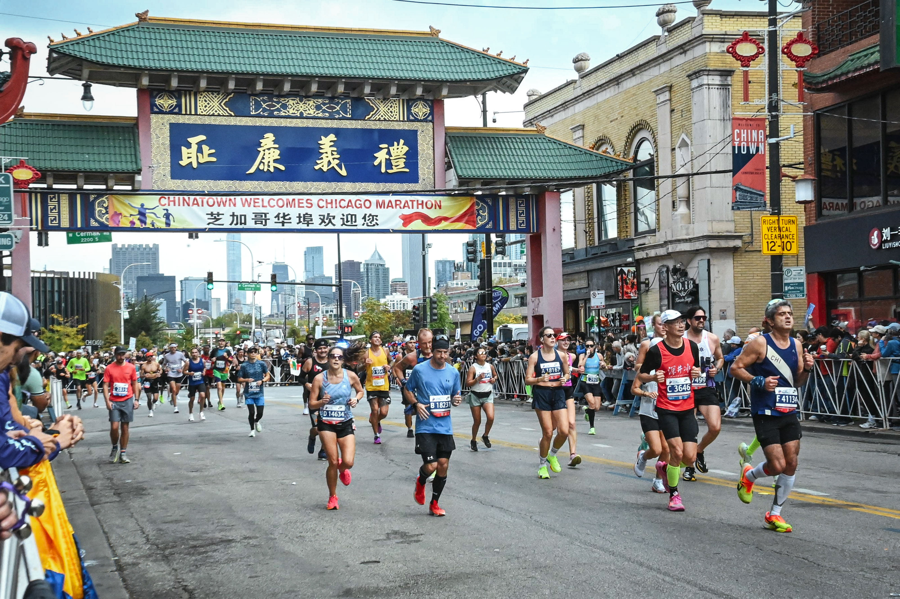
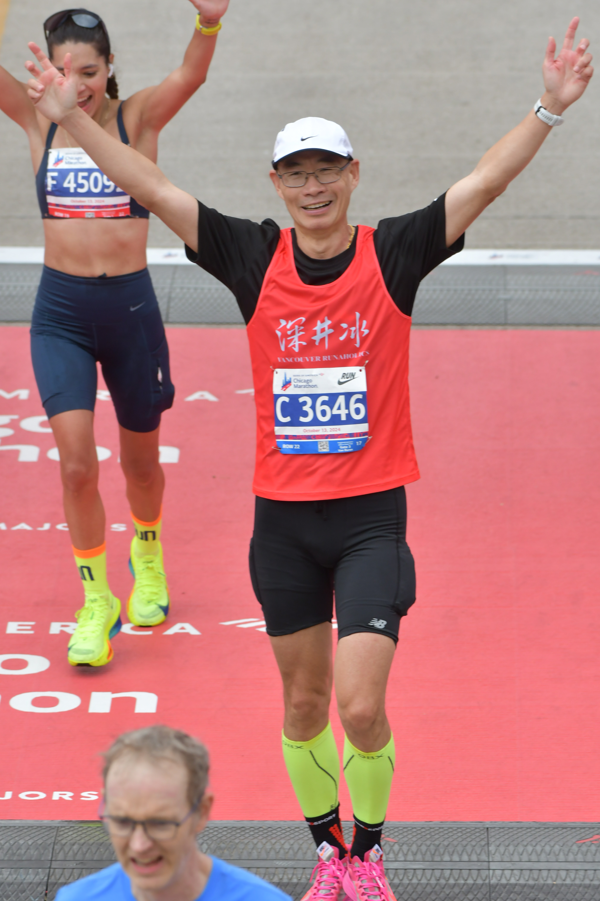
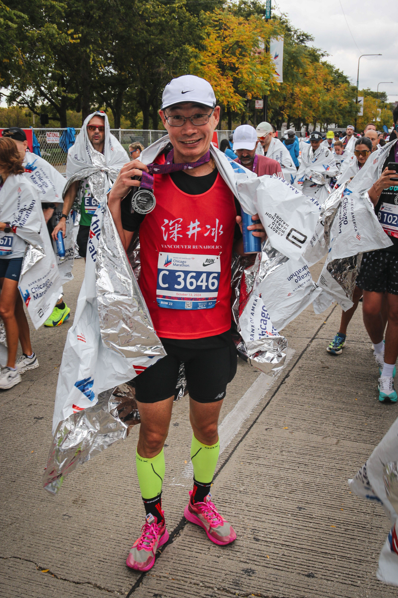

芝加哥馬拉松是我六大裡的第五大，也是跑的最慢的一個，需要認真總結一下。

## 賽前
今年的比賽比較多，不過馬拉松只有年初的兩個，分別是四月的倫敦和五月初的溫哥華BMO。然後就都是越野的比賽了，7月魁北克的QMT的110K、8月的胖狗120M和Squamish 50/50，另外九月底的Whistler by UTMB。所以自從五月的溫哥華馬拉松之後主要的訓練內容都是越野的低心率跑，一次間歇和Tempo都沒有跑過。

去年完賽UTMB之後柏林跑了307，給了我一個錯覺越野並不會影響馬拉松的成績。所以今年的芝加哥我的期望還是很高的，雖然倫敦只跑了328，溫哥華跑了317。不過年中的越野賽的成績不錯，完成了胖狗120M和Squamish 50/50的背靠背。特別是兩週前的Whistler by UTMB，70K組別4000多米的爬升跑了12個小時45分。Whistler本來還想跑一個25K的背靠背，後來放棄了最主要的考量就是想著不要影響2周後的芝加哥馬拉松。

跑柏林和倫敦的時候，前半程我還是可以保持415左右的配速，只是後半程掉速了。所以這次我的目標基本上是能保持這個配速到30公里就好了，這應該算是一個比較合理的目標吧。

## 比賽日
今年的天氣可以用完美來形容，早上起來13度左右，體感很舒服。最重要是沒有風，芝加哥是出名的大風，我們賽前已經體會到了大風的恐怖。而且今年我們住的Hilton位置很完美，早上五點起床，六點多我們三個才從酒店出發去起點。到了C區就去排隊排空，然後7點進入C區等待起跑。沒想到在C區還碰到了黑哥，我們一起站在了300兔子的後面。

起跑的時候跟著300兔子，開頭兩公里跑了4分的配速，感覺有點快。沒想到5公里後已經感覺大腿抬不起來，10公里後擺臂也感覺沒有力了，特別是左手。這是自從2019年BQ後從來沒有的情況，心裡很鬱悶，只能咬牙堅持，眼睜睜地看著配速往下掉，被無數人拍肩膀，心率從160一直掉到了140。最後35K大腿還開始有點抽筋的跡象，到一個aid station那裡抹了一點抽筋lotion後才堅持到了終點，最後完賽時間是3:36。

## 總結
這次深刻體會到了什麼是心有餘而力不足，心率很低，可是肌肉就是罷工了。這可能和我今年長時間低心率跑有關係，也可能和兩週前剛剛跑了一個70公里越野賽有關，不過歸根到底，還是實力的問題。越野和馬拉松的確是兩種截然不同的運動，跑馬拉松需要持續高心率跑3個小時以上，另外使用的核心肌肉群和發力方式也完全不一樣。以後要多跑間歇和tempo吧，讓自己的心率和肌肉都能夠適應高強度下長時間工作。一直以來我都很羨慕那些跑馬拉松可以跑到力竭的人，因為我自己做不到，心率剛剛上去，身體馬上就開啟了保護機制，不讓我做傻事。感覺肌肉發不了力，好像肌肉不允許我把他們給逼急了，所以跑馬拉松我從來沒有抽過筋。

雖然成績不理想，不過總算完成了六大裡的五大，就剩下東京了，心裡還是很高興的。希望11月的Road to the majors可以抽中東京，那就完美了。

這次有幸和跑了245的Eric Duan同房，從他身上學習到了很多東西：
- 準備比賽的check-list，避免少帶東西
- 關注每一個細節，賽前如何補碳，比賽的時候如何放鹽丸都考慮到了
- 賽前仔細研究賽道，甚至可以記下每個拐彎的位置

## 相片
感謝芝加哥chi跑團的義工拍的相片，效果感覺比官方的相片還好。

這相片很明顯能看出左手抬不起來

下面是官方的相片

