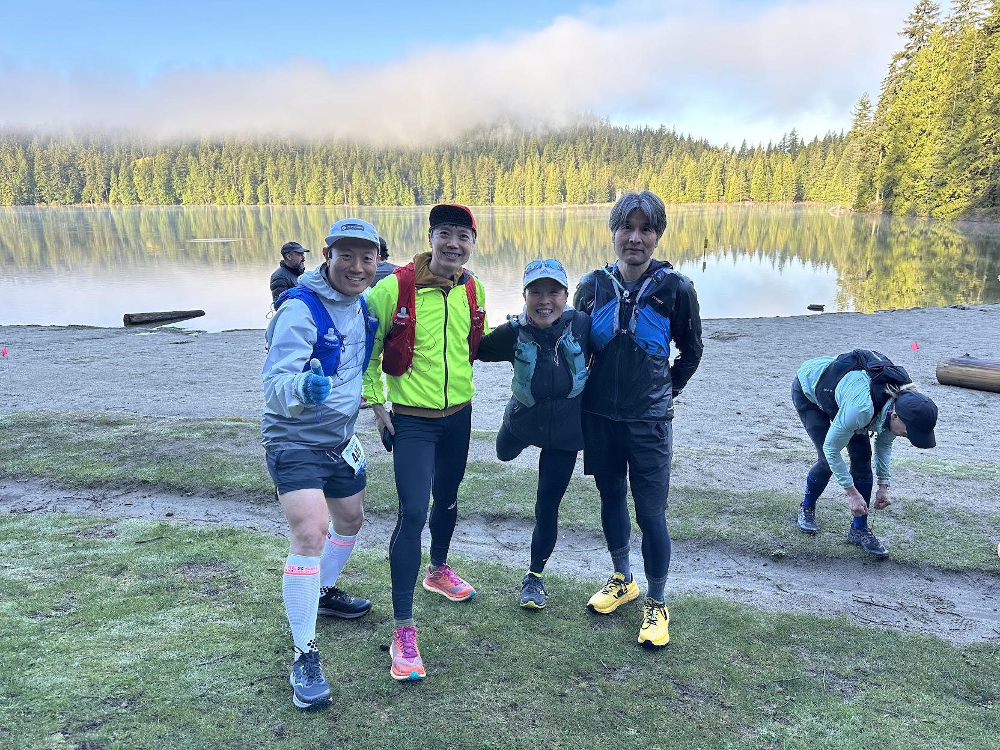
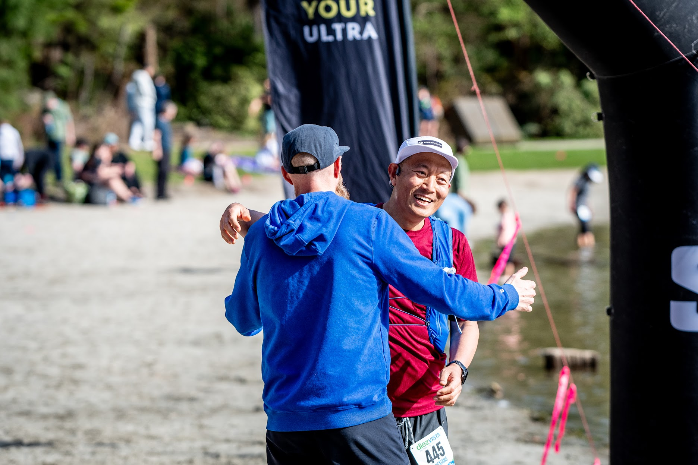
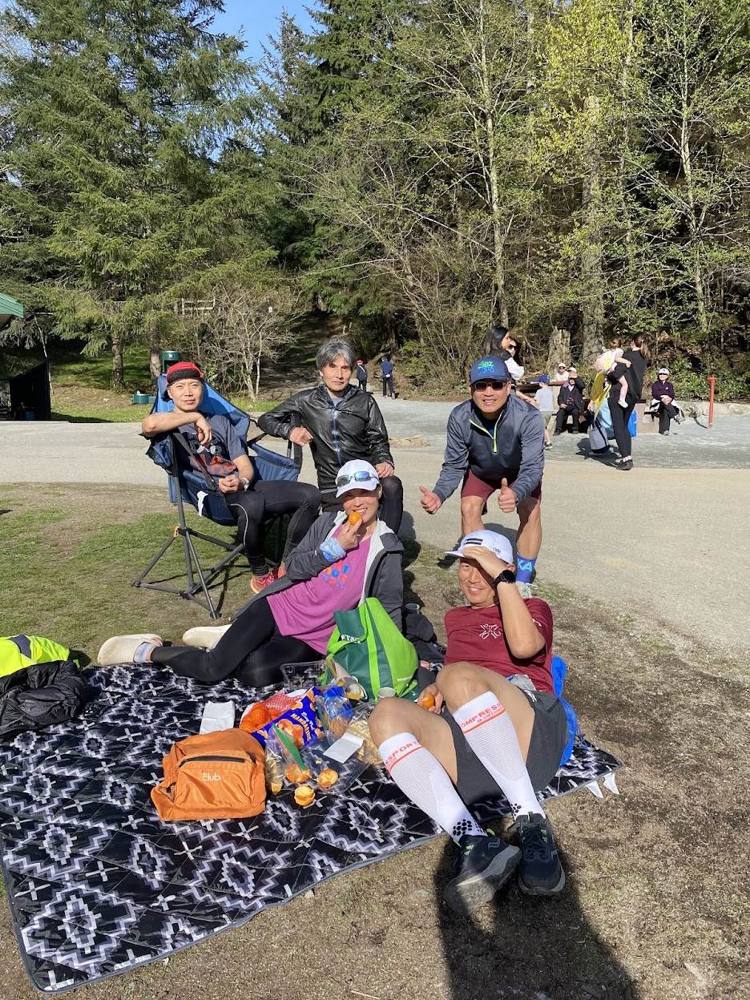
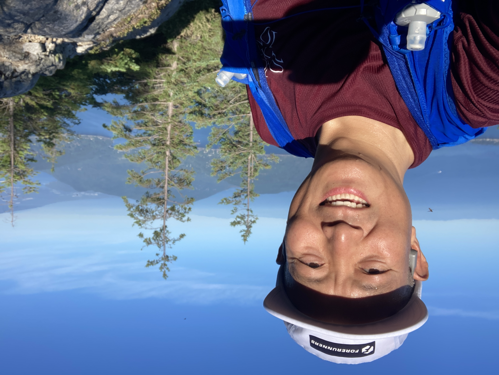
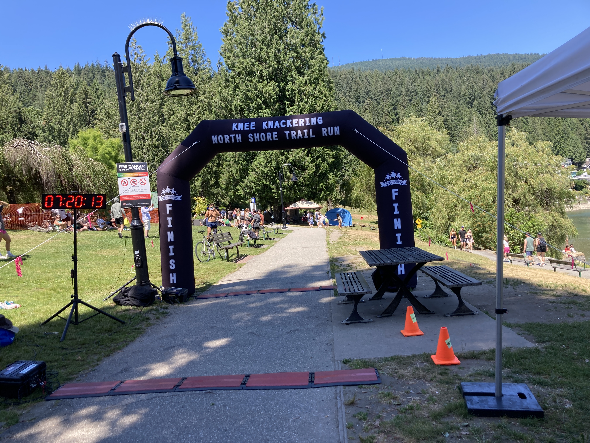
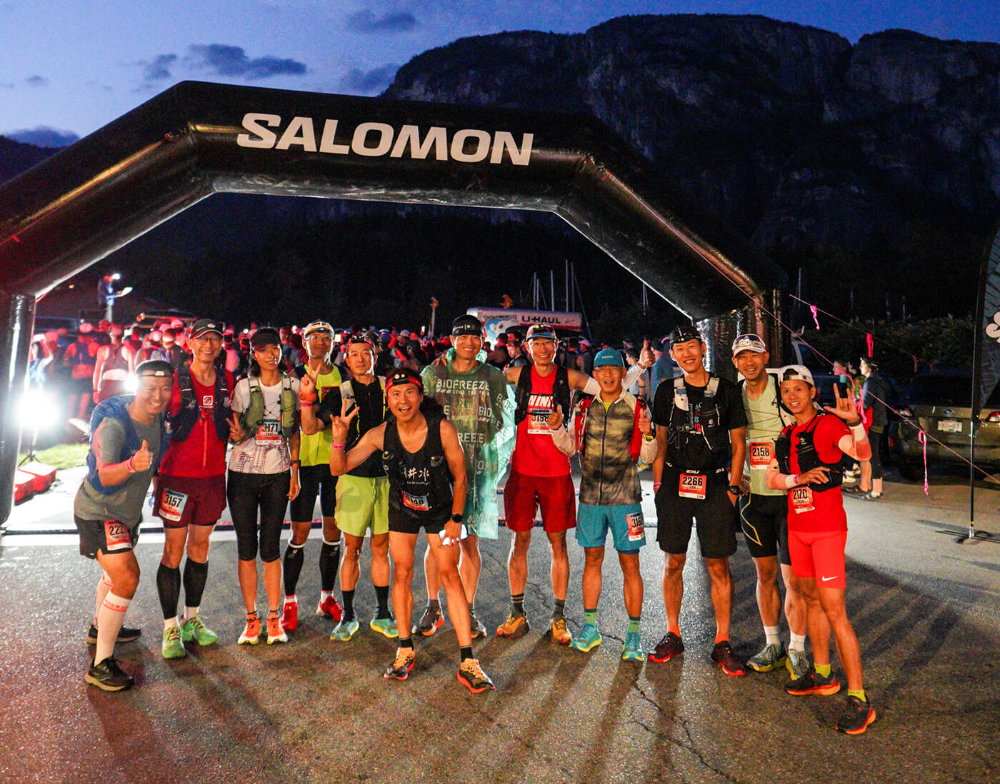
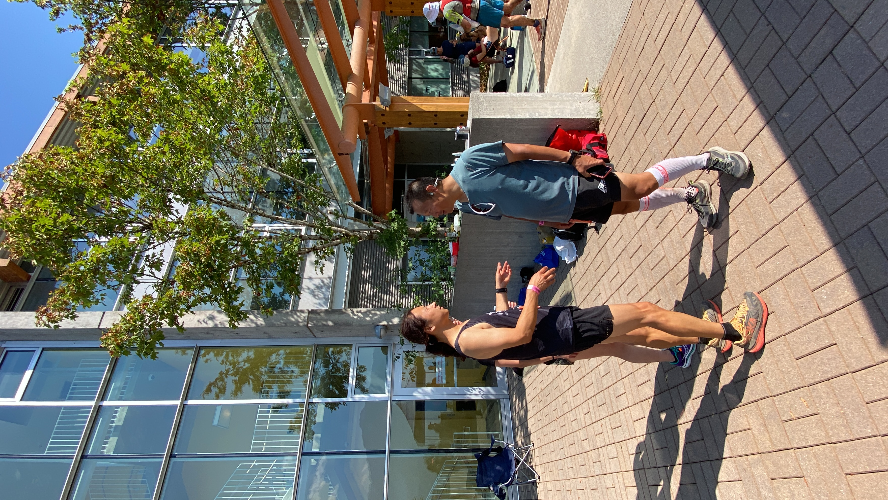
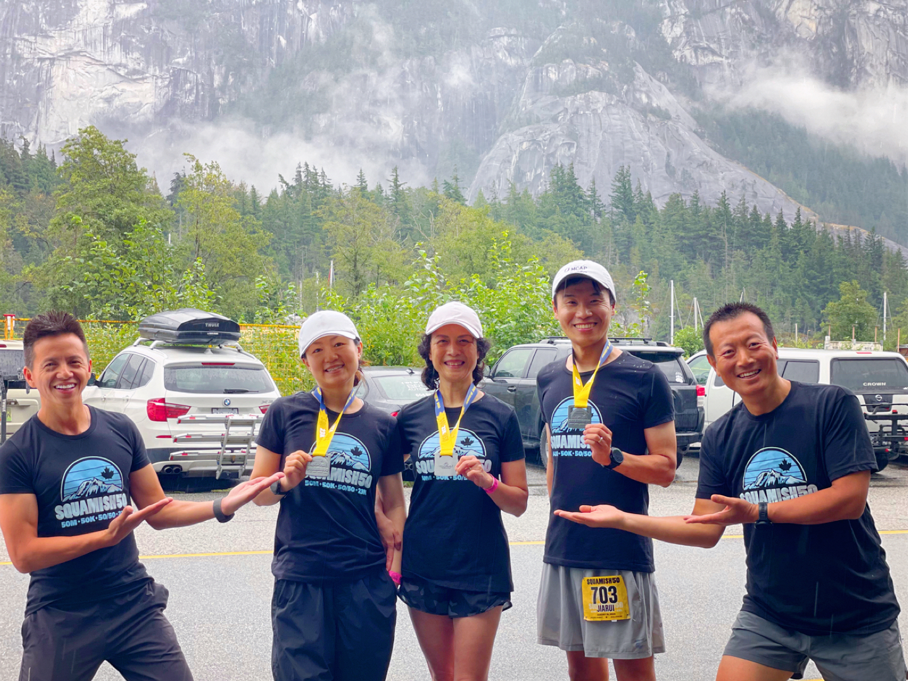
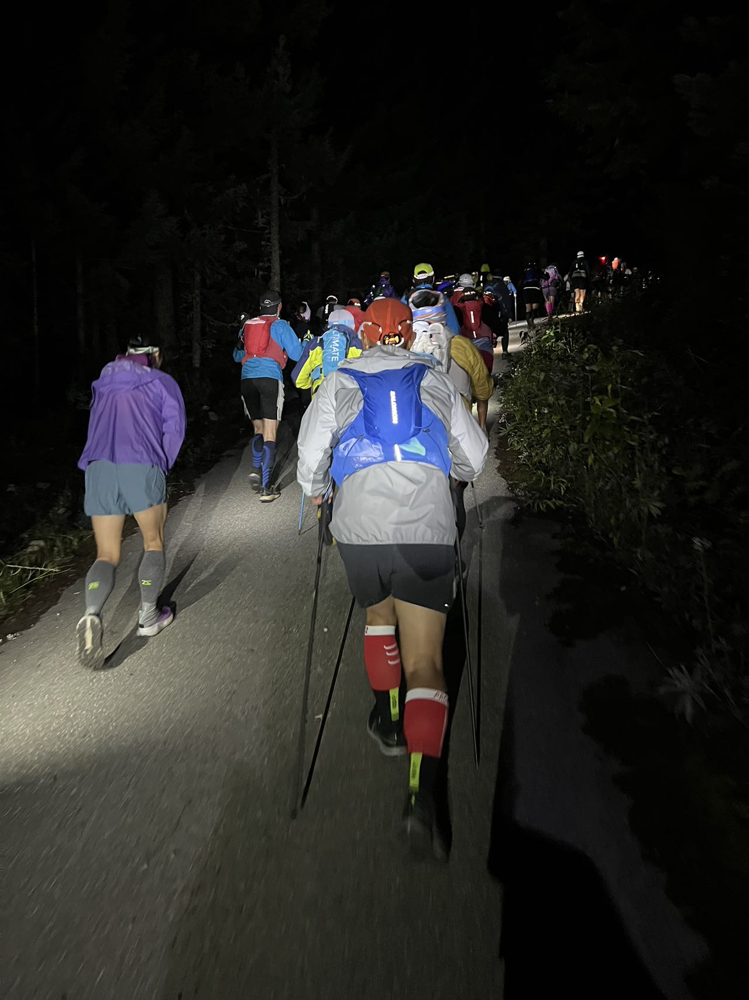

---
title: "2024，我的越野元年"
description: "老齊的越野元年"
image: 06.jpg
date: "2024-12-13"
author: "老齊"
published: true
featured: true
---

## 2024，我的越野元年

认识老齐的人都知道，他是个跑渣。遇到跑步的朋友就聊自行车，以此掩饰自己的尴尬。朋友们也渐渐都知道这是他的套路，只是不忍心戳穿，笑一笑就过去了。但是，在大温地区待久了，身边都是热爱运动的朋友，所以慢慢的也开始跑步，后来竟也参加了本地的跑步比赛，半马还有全马，居然也勉强完赛了！他后来也听说过什么跑马的尽头是越野，也知道本地的好多位大神都去欧洲参加了UTMB的比赛。只是对于他而言，那实在是太遥远的事情。作为一个成年人，他知道自己是不应该对生活有什么非分的要求的。飞鸟和鱼的距离实在有点大，能跑个步就行了，何况还有自行车。

但是阿甘的妈妈说过：“生活就像一盒巧克力，你永远不知道下一块会是什么味道。”2023年9月底，几位越野大神牵头要带大家去丝瓜迷失(Squamish)秋游，那里是本地已经举办多年的丝瓜50越野赛的赛道。老齐觉得机会难得，能跟大神们一起去看看丝瓜50  的赛道也是不错的，赶紧举手报名。至于原本计划好一起去岛上骑车的小伙伴们，他已经顾不上了。

2023年9月30日那天，天气非常好。跑越野的大神们个个英姿飒爽，谈笑风生并不影响脚下的速度，树根和石头以及路线的上下起伏对他们也如平地一般。对于老齐这只菜鸟，大家自然也都是非常关照，尽量放慢速度等他。当时他并不知道这是越野大神们发展下线的标准操作：要有耐心，就像钓鱼一样，线不能抻的太紧。就这样走走停停，加上中午在大学城附近充分的休息补给，老齐竟然也完成了丝瓜50公里的线路，虽然他是最后一个。秋日暖阳下斑斓的色彩和经年的落叶铺就的绵软的赛道让老齐产生了幻觉，似乎觉得他也能跑越野。那天他有点儿上头，直接的后果就是接下来报名了第二年好几个本地的越野比赛：4月份的Diez Vista，7月份的Knee Knacker，8月份的丝瓜50英里和9月底的Ultra Trail Whistler by UTMB。2024是老齐的越野元年！

✦ . 　⁺ 　 . ✦ . 　⁺ 　 . ✦

激情如潮水，来的快去的也快。比赛还是半年之后的事情，着什么急呢。船到桥头自然直，Hakuna matata!  虽然大神们提醒过，越野跑和路跑不同，要多上山练习，可是老齐已经忘记了。再加上右腿髋关节因负重训练受了一点伤，他从2月份First Half比赛之后就完全停止了跑步训练，更不用说跑山了。开春3月份骑行俱乐部的活动就开始了，他又忙着去骑车了！

该来的终究要来，4月13日的Diez Vista 50公里比赛如期而至，老齐是靠日历上提前设置的提醒才记起来这个比赛的。一点儿都没有准备啊，心里那是没着没落的，只能硬着头皮上。死猪不怕开水烫这句话用在这里实在是再合适不过了！🐷

### Diez Vista

比赛是早上8点钟从Sasamat Lake湖边的White Pine Beach开始。因为来这里游过几次开水，所以地方还算熟悉。和他一起比赛的有户外老兵马哥，岛哥、Sa姐和画家哥那天也正好来山上训练，于是就一起出发。这个比赛的赛道算是比较容易的，可是老齐当时并不觉得。未经沧海全是水，没去过巫山都是云！一开始大家还能在一起走，慢慢的老齐就跟不上了，毕竟是没有训练。他是每站必进，吃点东西，喝点水，磨蹭一会儿。比赛熬到了下午时分，从30公里处折返的时候，太阳已经很晒了，还在往30公里折返点跑的选手很多已经无精打采。此时老齐感觉自己的右脚已经受伤了，他只能慢慢往前挪。在终点前几公里的地方还有一大段碎石路面，像是新石器时代的原始人打磨出来的切割器，每一片都很锋利。

在他好不容易来到终点的时候，时间已经是下午四点半，已经早早跑完的马哥、岛哥、Sa姐和画家哥已经在湖边等到无可奈何。从后来发出来的比赛照片来看，他们几位下山的时候都是飞下来的，一个个极其享受的样子。这个比赛老齐的完赛时间是8小时32分。虽然受伤，可还是完赛了。对于一个没有训练的人来说，还能要求什么呢？

### Knee Knacker

Knee Knacker是一个非营利机构举办的独立赛事，赛道是北岸从马蹄湾到Deep Cove的Baden-Powell Centennial Trail (BP Trail)，全程48公里，是加拿大最难的30英里赛道之一。参赛选手限制在262人，都是通过抽签决定。老齐居然第一年报名就中签了，beginner's luck.  比赛时间是7月13日。在比赛之前，主办方还组织了若干次训练跑，让大家去体验一下不同的赛段。老齐只参加了其中一次，还遇上大雨迷了路。

比赛那天，老齐带着一种无知者无畏的心态就上山了。他事先完全没有做功课，到底有几个补给站，每个站点的关门时间是几点钟都不知道。BP的赛道不是白给的，上来1000米的爬升就给他来了个下马威。本以为爬到山顶之后往下走的路总可以快一点吧，谁知接下来的部分都是技术路段，各种树根石头，根本跑不起来。到了第一个大补给站的时候，他已经被告知时间很紧张了。虽然这一站不会被关门，但是一点都不能减速。可是速度不是说提就能提起来的，老齐终于还是在下一个站点Cleveland Dam被关门了。被关门的感觉是不爽的，可也是一种解脱。好歹算是跑了一半的距离，后半程的赛道一点儿都不容易。群里的Mae那天是做志愿者，多亏她开车送老齐到Deep Cove终点。当天的天气是极好的，王青、Sunny和叮当在终点准备了各种好吃的等群里的参赛选手冲线，可她们万万没有想到第一个等到的会是老齐，而且是坐车来的。后来听Yong哥说，这个比赛中签率还挺低的，老齐这个参赛名额算是白瞎了！

### Squamish 50 Miles

因为去年夏天已经和大神们跑过了丝瓜50公里的赛道，老齐从一开始就决定要报名50英里的比赛。丝瓜的比赛有三个组别，周六是50英里，周日是50公里和23公里。丝瓜50是很多越野大神几年前起步的地方，因此一向是群里朋友们热衷的赛事。今年果然又是一个大爬梯，各个组别参赛选手加到一起得有20人了。群主追云提前订了一个大house，方便大家在一起玩的开心。然鹅，周五晚上的聚餐老齐竟然因为其他事情的耽搁无法参加，只能隔着屏幕看着大家举办补碳大会发来的各种美照流口水。等他赶到的时候已经是半夜了，大家都已经睡下，他于是就胡乱在客厅的地毯上凑合了一夜，旁边是石大夫和MT。

有了上次Knee Knacker被关门的经验，这次老齐提前就规划好了撤退的路线。大学城是个大站，也有我们的小伙伴在，交通还方便。如果要退赛，就在这里退！哦，还是先说比赛吧。50英里的比赛是在黎明前东方已经露出曙光的时候出发的，背景是壮观的酋长岩（Stawamus Chief）。因为是从城里出发，所以前面十公里大家都是带着头灯在马路上跑。路是平的，大家速度都很快。前半程的比赛波澜不惊，都是在山林里各种穿梭，起起伏伏。中间有一段很长的大上坡，虽然慢，也熬人，但老齐觉得还能坚持。最难的地方是一段大下坡的技术路段，他走的实在太慢了，也开始问自己为什么要参加越野比赛。路跑不香吗？自行车不香吗？

等到快到大学城那站的时候，老齐已经快被晒蔫了，腿上也没有了丝毫的力气。虽然离这一站的关门时间还早的很，可是接下来20公里还是有很多爬升，如果坚持下去的话，怕是要跑到晚上10点钟了。久已潜伏心底的退赛念头此时突然跑了出来。为什么要这么折磨自己呢？比赛不是为了享受吗？如果万一受伤的话，那么下周二的长途骑行岂不是要泡汤了？于是，在离大学城几公里的地方，老齐决定要退赛了，一下子觉得心情放松了很多，接下来的几公里也不难了。

爬上大学城的台阶，进到补给站，老齐直接告诉负责登记时间的志愿者，他要退赛。这里是第五个补给站，大约53公里处。June和Rachel在这一站给大家做私补。可是，让老齐没想到的是，MT这个浓眉大眼的精英选手竟然也在这一站退赛了！

### Ultra Trail Whistler by UTMB, 70k

Whistler的比赛是UTMB第一次来加拿大办比赛。因为是第一年，所以赛道前后更改了三次。一开始是有100公里、50公里和25公里三个组别。后来100公里的路线调整到了61公里。老齐最初报名的是50公里组别，现在看到100公里组别（可以拿到三块石头）只比50公里多11公里，爬升也差不了多少，于是决定换到100公里组别。可谁知这个组别的距离后来又调整到70公里。别管那么多了，硬着头皮上吧！

照例，比赛前一天下午领物，晚上组织补碳大会。老齐要和石大夫一起走，得下午六点才能出发。于是大同代为领物并把老齐事先准备的鲍鱼捞饭交给存包的工作人员（老齐对于比赛中最走心的环节永远是补给，而不是比赛本身）。他和石大夫晚上九点多赶到的时候，补碳大会仍在热烈的进行中。大家给他俩留了很多好吃的。在这个集体中，老齐经常是备受关照的那一个，他觉得很温暖。

70公里组的选手早上五点钟出发，天很黑，也很冷。在出发点片刻的欢呼和喧嚣过后，便是参赛选手们逶迤前行沙沙的脚步声。大家都戴着头灯，队伍也慢慢拉开变成一条长龙，像是夜行军的队伍。赛道的前30公里都是上坡，路还算好走。这一段是老齐整个赛程中走的最舒服的一段。第一个补给站是Roundhouse，Jeremy今天做志愿者，负责这个站点。现在天还早，还不到鲍鱼捞饭时间。Jeremy告诉老齐，他会计算时间在老齐返回之前把鲍鱼捞饭先帮他加热好。补给站有自己人的感觉真好！这次比赛线路设计不太好，据说是因为志愿者人数不够的原因，线路有好几个loop，大圈儿套小圈儿。Roundhouse补给站要前后经过四次，Whistler Summit要经过两次，最后的Middle of Nowhere要经过两次。整个白天就是在这样不停的绕圈中度过的。第二次经过Whistler Summit下山的时候，天已经非常冷了。老齐随便吃点东西，赶紧下山。本以为下山的路会好走一些，谁知道竟是十几公里的树根烂泥路，想快也快不起来。等到最后一次经过最后一个补给站的时候，距离终点就只有3公里了。可是这3公里的距离竟然也不是直路，更不是平路，老齐居然也走了40分钟。他再次下定决心，以后再也不跑什么越野赛了！

等到老齐终于冲过终点的时候，时间已经是晚上9:45了，还有不少的志愿者在终点为选手们欢呼、拍照、发奖牌。感谢他们的付出！虽然没有白天热闹，但老齐也知足了。比起他的长途骑行，这已经很好了。骑车的时候，经常是一个人黑灯瞎火骑到一个地方，看一下手表时间，自己给自己打个卡，一次骑行就算结束了。这里终究是比赛，还是有人欢呼、拍照和发奖牌的！夜色深沉，也有些冷，老齐蹒跚走到路边的台阶坐下，掏出手机给关心他的朋友们发了微信：终于完赛，累劈了！

### 后记

2024年是老齐的越野元年。他一共报了四场比赛，第一场完赛但受伤，第二场被关门，第三场退赛，第四场勉强算是无伤完赛。他跟朋友们说，明年要改元，改成大铁元年，越野跑是不能再搞了。不过谁知道呢？老齐的话有时候也没准儿，让我们拭目以待吧。

