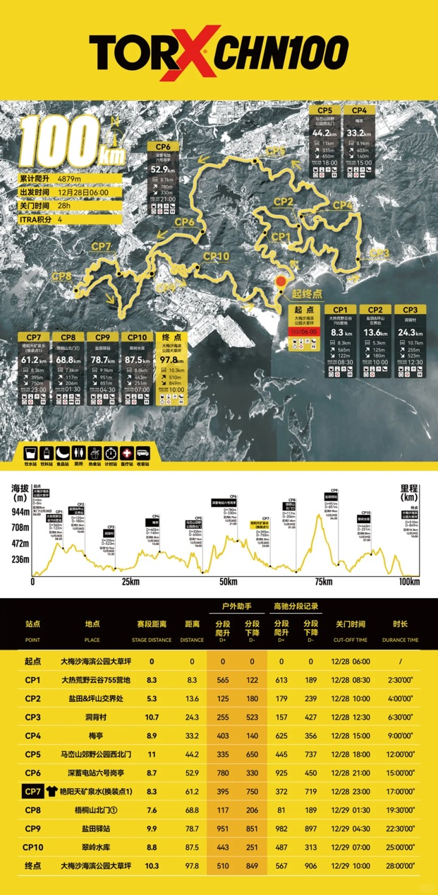
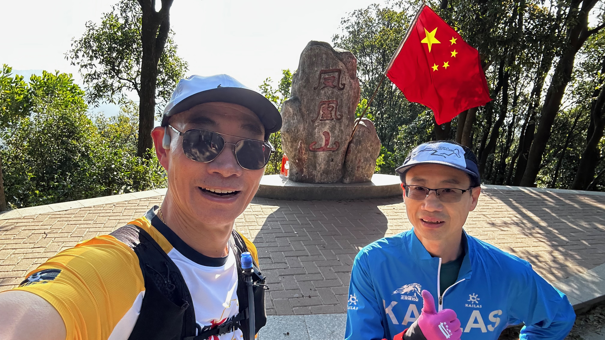
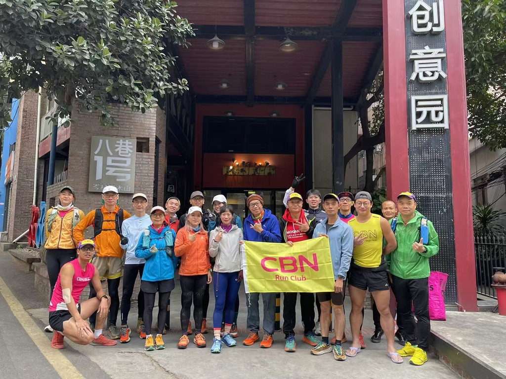
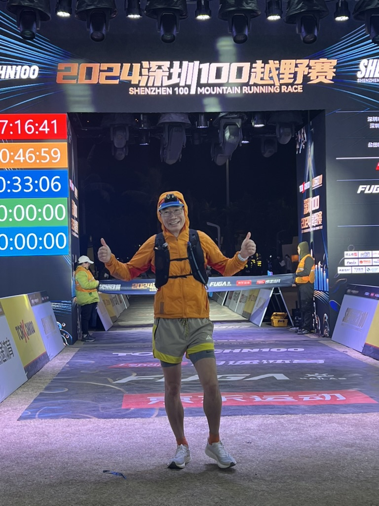
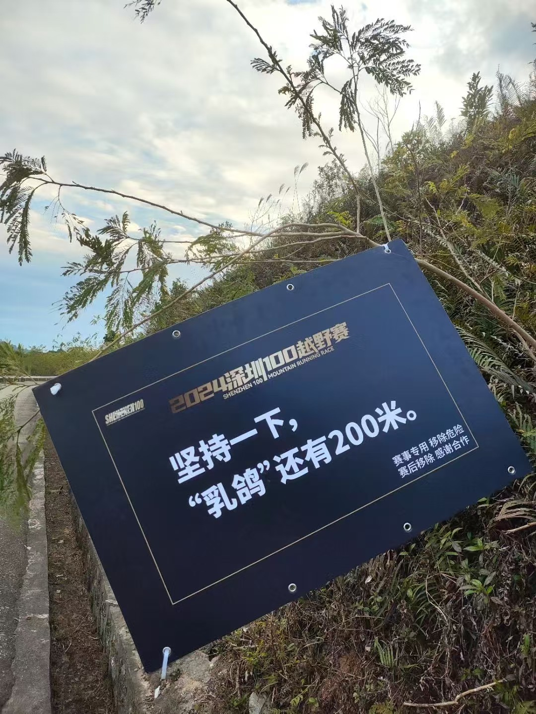
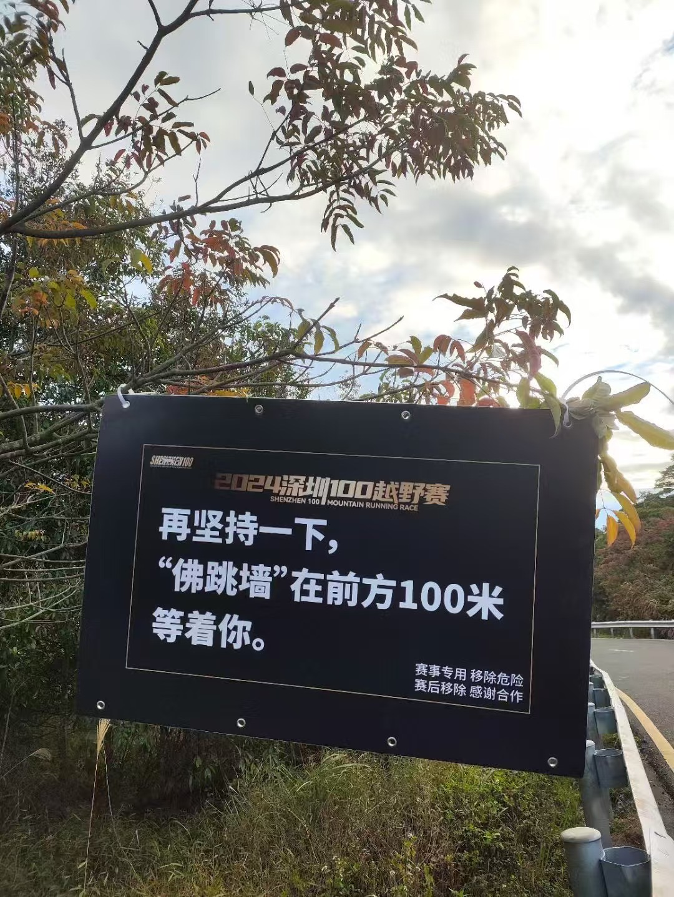

## 赛事背景与报名
2024深圳100越野赛是深圳地区最具影响力的越野跑赛事之一，由深圳市文化广电旅游体育局和盐田区人民政府联合主办，朗途体育运营。赛事设有168公里、100公里、50公里、35公里和10公里亲子组五个组别，吸引了来自19个国家和地区的近5000名选手参赛。

我本來報名的是168公里，但後來Eric提醒我說100公里組別才是與意大利頂級越野賽TORX®合作的賽事，有機會參加今年在意大利舉辦的TORX®賽事，於是我就退了168公里組別，和Eric一起報了100公里組別。

100公里组别起点位于大梅沙海滨公园，赛道贯穿梅沙湾公园、东部华侨城、马峦山郊野公园等多个景点，累计爬升4768米，关门时间为28小时。大梅沙海滨公园是深圳著名的海滨公园，也是深圳市民休闲娱乐的好去处，附近就是鹽田港。

上次Eric來深圳已經是20年前，而我二十多年前第一次來深圳出差就是去鹽田港。看來冥冥之中我們和深圳都是有緣的。只是沒想到我們出走半生，歸來的時候是以腳步丈量這座城市。

## 赛前准备

比賽是2024年12月底，而我是12月初就回廣州了。賽前，我和廣州本地的一個跑友小牛（小牛是我在跑UTMB時候認識的廣州的跑友）一起訓練，認識了一些本地跑友。跑步最近幾年在中國十分火爆，很高興有機會認識更多廣州本地跑步的朋友。我們一起跑了一次次20公里的火鳳火線（火爐山-鳳凰山-火爐山）和30公里的火雷火線（火爐山-雷達站-火爐山）。這兩條都是廣州本地比較出名的越野訓練線路，另外還有更長的50公里的火帽火線（火爐山-帽峰山-火爐山）這次沒有嘗試。這些線路的特點是硬化路很多，和深圳100的線路比較類似，正好適合準備深圳100的比賽。而且這些路線補給很方便，天冷的時候半路還可以來一碗地道的姜醋豬腳，這對於喜歡吃吃喝喝的跑者來說，真是太方便了。

## 賽前花絮

第一次參加國內的越野比賽，賽前去參加Expo的時候感覺氣氛很不錯，搞得像是一個嘉年華，有各種吃的喝的，還有各種遊戲，還有各種打卡拍照。

不過最有趣的事是各種偶遇，先是碰到了鈞月，然後碰到了苗哥苗嫂，最後還碰到了和Eric一起跑TORX的大Tim。苗哥這次跑168公里，苗嫂則是跑100公里組別。當然，他們都是受邀精英選手，可以和精英選手一起拍照實在是太幸運了。

## 比赛过程与赛道体验

熱鬧歸熱鬧，考驗還是得面對。2024年12月28號早上六點，比賽正式開始。

我這次比賽主要是為了四月份的fuji100做準備，所以主要想以賽代練，以賽代訓，準備做一些以前沒有嘗試過的東西。fuji要求不能使用杖，所以這次比賽我沒有使用杖；另外由於硬化路很多，所以準備使用李寧的碳板路跑鞋來跑這次比賽。比賽以70公里為分界線，分為兩個部分：前70公里一路狂奔；後30公里小心翼翼，步步為艱。

### 前70公里

比賽當天正好有寒潮，深圳的氣溫驟降，而且風很大，所以比賽當天早上還是挺冷的。跑到山頂的時候看到了日出，真是太美了，就是風太大了一點。出發後挺順利的，一個多小時就到了第一個補給站，喝了點咖啡，沒有多停留就繼續上路了。

前面幾個補給站都挺順利的，沒有什麼特別的，就是一路狂奔，感覺很爽。路跑鞋跑起來的確輕鬆，只是抓地力不夠，下坡的時候需要小心，很容易滑倒。前面沒有太多大下坡，所以問題不大。我上坡不快，但是平路和下坡就還是比較快的。所以經常發生上坡的時候被後面的人超過，下坡的時候又超過別人的情況。這中間還發生一件比較有趣的事情，從CP5開始，我就發現一個女生總是和我前後腳，上坡的時候她超我，然後下坡的時候我超過她，然後我們總是前後腳進站，就這樣一直到CP7。由於前後見面的次數多了，後來碰到的時候都會互相笑一笑，算是打招呼。我在CP7耽誤了一點時間，出來晚了一點，在一段平路追上來她。我忍不住跟她說，你跑的太好了吧，成功搭訕上，接下來一段路我們就一起邊跑邊聊。一聊才知道她真是大神，曾經是站台選手，2019年就完賽UTMB，完賽時間36過多小時。只是後來疫情這幾年耽誤了，這次是復出第一次參加越野賽，沒怎麼練。我說幸虧你沒有練，要是練了我就只能吃土了。就這樣邊走邊聊，下午4點出頭到達了梧桐山腳，完成了70公里，用時10小時12分。

### 後30公里

過了梧桐山門後，真正的考驗就開始了。這段有1000多米多爬升，開始還能跟得上這個女生，後來就有點吃力了。快到頂的時候感覺冷了，我就停下來加了一件衣服，就停了幾分鐘，後來我就再也沒有見到她了。後來有點遺憾沒有問她姓名，賽後查了一下成績單，原來她的名字叫Li Hongxia，完賽時間16小時23分，overall排名54，年齡組第一。還查到了她的UTMB Index(https://utmb.world/runner/919237.hongxia.li)，真是大神。

費了老大勁爬到梧桐山頂後，才發現惡夢才剛剛開始。因為下降也很陡，而我沒有杖，最要命的是路面有一層細沙，路跑鞋的抓地力不夠，很容易滑倒，而且沒有杖的輔助，下坡很難控制速度，天又黑了，所以這段路可以說是步步驚心。上山和下山一樣慢，天黑後看視線也差了，下山的時候頭碰了兩次樹枝，還好沒有受傷。後面30公里用了快8個小時，晚上11點多的時候終於到了終點，完賽時間17個小時12分。

完賽證書上的爬升只有4879米，但是我的手錶記錄的有5700米的爬升，差了1000米，可能是我的手錶虛高了。其他人記錄了5300-5600米的爬升，也都是比賽官網的爬升要多不少。

### 豪華補給站

這次比賽的補給很豪華，這在賽前就已經聽說了，號稱會有乳鴿和佛跳牆。我倒是還都吃上了，貨真價實的有人參的佛跳牆。

## 完赛感受与收获

第一次參加國內的越野賽，不過這次比賽整體體驗不錯，補給豪華，看到了深圳不一樣的風景，還是收穫滿滿的。雖然後面30公里挺煎熬的，但是還是堅持跑完了，為fuji100做了很好的準備。

Eric由於剛剛長途旅行，時差還沒有調整過來，比賽的時候影響了狀態，比我慢了一點，不過他還是輕鬆跑完了。回來睡了一會，第二天就恢復了。早上去吃早餐，結果他選擇了豆漿油條，真是太好吃了，我們都覺得這是這次比賽最美味的早餐。原來在經過了各種折磨之後，最簡單的其實是最好的。

·