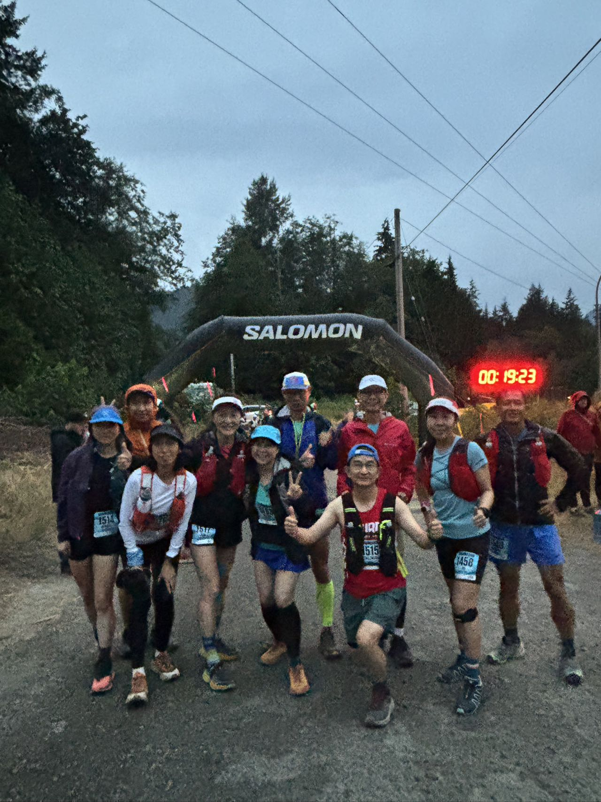
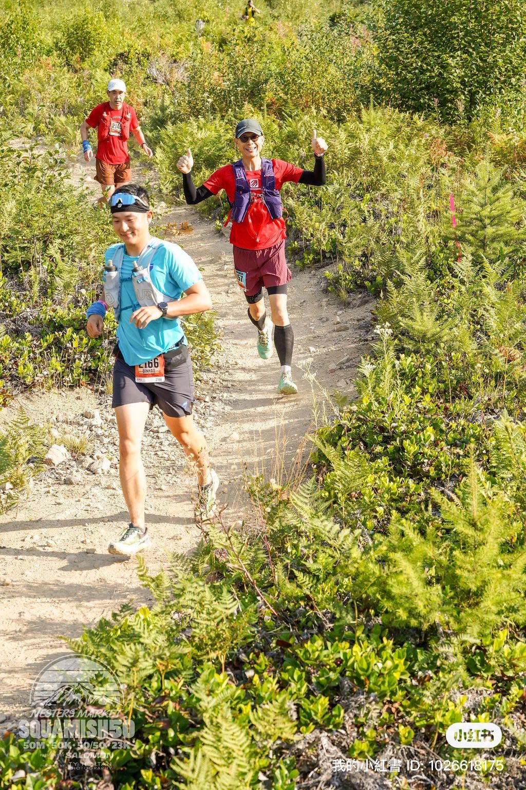

2023年11月的一天，我无意间在跑群里听到一个消息：温哥华最著名的越野比赛之一——Squamish 50/50即将开放报名。这场比赛向来以其赛道的挑战性和报名的火爆著称，名额总是转瞬即逝。两年多来，我一直专注于跑马拉松，已经完成了六大满贯的五个。2024年2月跑完东京马拉松后，这个梦想就将圆满达成。就在这时，心里冒出一个念头：是时候尝试一些新的挑战了。

越野跑，一直是我心中一个陌生又充满吸引力的领域。而Squamish 50/50，无疑是一次绝佳的机会。于是，我早早设好闹钟，满怀期待地抢下了50英里和50公里背靠背的参赛名额。

## 赛前准备

2024年6月9日，我跑完了西雅图隧道马拉松，这是我上半年的第五个马拉松，也是我首次成功破三的一场比赛。在实现这一重要里程碑后，我的越野跑备战正式开始了。

恰逢几个跑友计划挑战著名的Triple Crown（三冠王越野挑战），我毫不犹豫地加入了他们的队伍。比赛当天清晨，野马营的大队长追云开车把我们送到起点。整段挑战过程中，我们需要在一天内完成70公里的赛程，同时克服3900米的累计爬升。这是一次全新的尝试，也让我第一次深刻感受到越野跑的独特魅力。从清晨的兴奋到黄昏时的疲惫，再到晚上9点顺利抵达的喜悦，这一天的经历仿佛是一场体力与意志的双重洗礼。

随后，我的训练重心转移到Grouse Grind。这条以“自然阶梯”著称的线路，每次攀登都像是一场艰苦的拉练。在越野前辈阿虚师傅的陪同指导下，我逐渐适应了越野跑的节奏，从爬升的技巧到下坡的放松，一切都在有条不紊地进行。每一次汗流浃背的训练，都让我离Squamish 50/50更近一步。

## 比赛周末：挑战的开始

8月16日周五，我和June还要阿须师傅一起去领取了Squamish 50/50的号码簿。和马拉松的号码簿相比，这个显得更小巧，但却需要用两天，因此必须妥善保管。当天晚上，十几位跑友聚在一起，准备补碳晚餐，气氛其乐融融。大家聊着比赛的赛道和策略，虽然对即将到来的挑战心怀敬畏，但更多的是期待。

这次比赛，我给自己定的目标是“无伤安全完赛”，毕竟9月的柏林马拉松是我的重点赛事。

### 第一天：50迈（80公里）

8月17日凌晨4点，我准时起床，简单吃了点早餐，搭车前往起点。5点半，背靠Chef山崖，带着头灯，我们正式出发。前10公里的平路是热身的好时机，我把配速控制在每公里5分40秒左右，很快，10多人的队伍便拉开了距离。

到第一个补给站时，发现地点居然是在我以前去Whistler常充电的地方，颇有些亲切感。我补充了饼干和薯片，顺便上了厕所，然后离开补给站，进入赛道的山地部分。这段路开始上下坡，坡度不是很大，继续匀速推进。

每个补给站是我最期待的地方。西瓜、饼干、薯片，还有可乐，是必不可少的能量来源。在大学城的补给站，我遇到了后援团的Rachel和June，吃到了他们带来的肉包子，瞬间觉得味道好极了。而在最后一个补给站，居然还有热饼和培根，这些美食让我暂时忘记了疲惫。

后半程，我和Jeremy一路结伴，边聊边跑。他分享着越野的经验，甚至鼓动我去报名香港百公里越野赛。比赛过程中，我发现我的背包不太合适，水袋的挤压让我胸口疼痛，最后只能把水袋放在背后。另外，长时间低头盯着路面，导致颈部像落枕一样，非常难受。

比赛中还有个小插曲：下山时跑得太急，结果冲错了一个坡，只能爬回原路。好在只是多跑了一小段，远比跑友Andrew多跑10公里幸运得多。

最后几公里回到马路上，我提速到每公里5分45秒，超了几个人，最终以12小时50分钟完成第一天的比赛。冲线后，赛事组织者Gary听说这是我第一次跑50迈，而且第二天还要跑50公里，特意奖励了一盒能量棒。终点处，跑友Wendy和June帮忙安排补给，我吃了包子、汉堡和啤酒，还享受了一次赛事的按摩服务。

回到住处后，风渐渐刮了起来，预报说第二天有大雨。晚上的休息并不充分，直到半夜12点才睡着。

### 第二天：50公里

8月18日周日，凌晨3点半，我在闹钟中起床，收拾行李，准备第二天的比赛。这一天需要坐班车到起点，只有不到3小时的睡眠让我有些疲惫。出发时，天气预报显示有中雨，我决定穿防雨衣。但结果雨势不大，防雨衣一路都系在腰间，显得有些多余。

相比第一天，第二天的比赛明显更辛苦。特别是中段，我感到又困又累，连吃东西的胃口都减弱了。在大学城补给站，没有了昨天的包子，幸好遇到跑友Jessie，她分给了我一个茶叶蛋，这才稍微恢复了些力气。

中段路程没有熟悉的跑友陪伴，这段路让我感到有些孤独，甚至一度产生了不想继续跑下去的念头。但想到比赛结束后还要赶去机场，坐飞机去多伦多出差，我强迫自己继续跑下去。

在最后一个补给站，我吃到了热饼，胃口一下子回来了，连吃了三个，感觉自己已经挺过了最困难的阶段。跑到山下的马路时，一个义工告诉我：“按你这个速度，应该能超不少人。”这句话瞬间点燃了我的斗志，我越跑越快，配速一度达到每公里4分37秒，最后2、3公里甚至超了20多人。

冲过终点的那一刻，我接过象征首次完成Squamish 50/50的蓝帽子。这一天的50公里，我用时9小时10分钟。由于赶飞机，我在终点没有停留太久，热心的老齐开车送我去停车场，结束了这次越野跑挑战。

## 总结

从80公里到50公里，两天共计130公里的越野赛让我体验到了与马拉松截然不同的挑战。Squamish 50/50不仅是对体能的考验，更是对意志的磨炼。带着这次经验，我对未来的越野跑充满了期待，同时也更加珍惜比赛中每一段珍贵的回忆。

