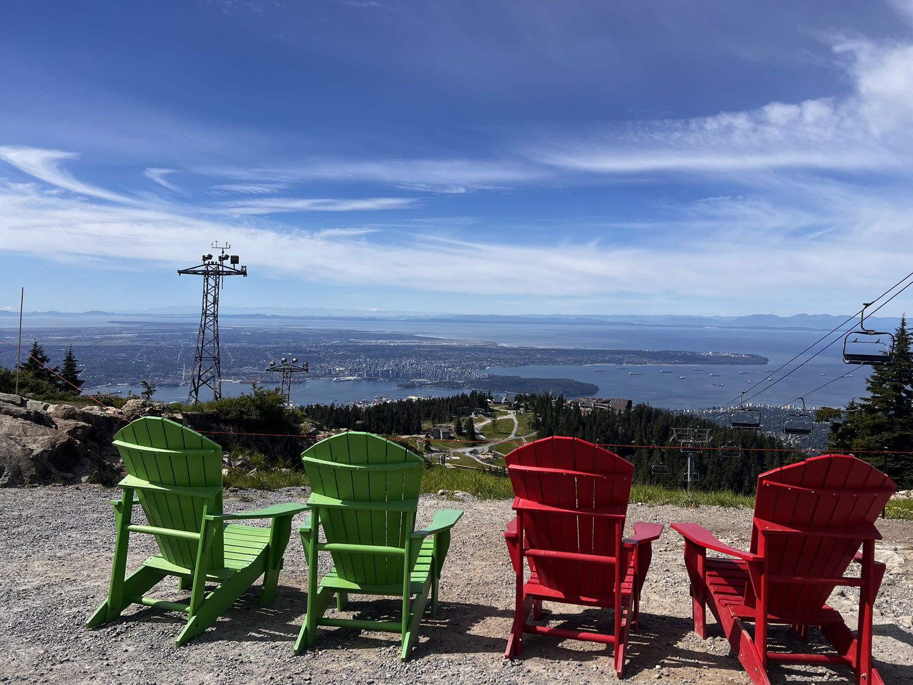
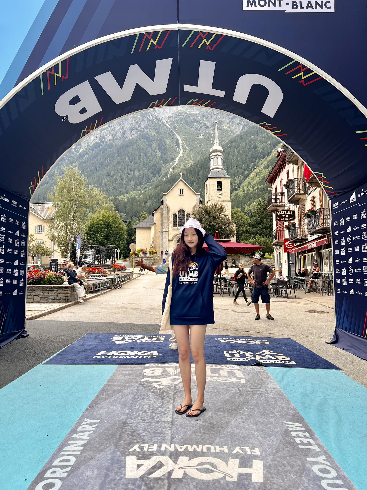

# 希望的夏天

## 王青

> 原文链接：[https://www.meipian.cn/56qiwr07](https://www.meipian.cn/56qiwr07)

---

我的第一场百迈越野—UTMB

写不写UTMB百迈赛记，纠结了一周。睡眠不足，比赛的记忆被碎片化了，忘的忘乱的乱，难以拼凑。但考虑到脑力日渐衰退，现在不写的话以后更捡不起来了。回家以后弟妹问我：这是你跑步的第十年吧？从家门口蹓跶200米就气喘如牛跑3分钟要走5分钟，到10公里，到半马到马拉松，完成大满贯，再一步步来到UTMB，原来已经十年这么久了。

那就按照时间线录一篇流水账吧，别忘记是怎样度过了2024年的夏天，怎样度过了这十年。

住在温哥华，很难不爬山，也很难不越野。跟着朋友们试水越野的四五年，深知自己在山野的能力更低马拉松几个level，比赛没跑多少，因伤退赛和被cut倒是都经历了。UTMB这个176公里10000米➕的挑战，仿佛一个看得着也摸得着却很不现实的梦，大大超出我的能力。

2022年生病，23年春天玩赛了名古屋女子马，然后入院手术，直到秋天恢复跑步，近两年没有系统性训练。11月在朋友们的鼓励怂恿之下参加了墨西哥 Puerto Vallarta 50K越野赛，成绩虽然难看，但是跟好友一起玩耍的几天又重燃对跑步的热情，激活了Index分数，拿了新石头。

24年初开始增加跑量，200，300，400，直到5月中旬山顶冰雪消融加上爬升。我和世界上最好的训练搭子Sunny 开始了grouse mountain 松鸡山上班的日常,以它为中心安排整个训练计划，有时从温哥华海拔最低点高尔夫球场跑到grouse grind 再一路向下跑回温哥华，70公里两千爬升完成当日训练，有时GG五到六趟只练爬升4000到5000米，爬四趟就加上HWY和BP或者BCMC下，或者在太平洋公园小道上硬刷50公里。每周三个大训练日，早5点起床晚7点回家，保证当日有7到12个小时运动时长。

到后来不能说我俩对GG和Mt hwy 的每块石头了如指掌，只能说不管走到哪个位置都能一秒说出此刻精确爬升。

在长长的训练时光里，我俩遇到熊遇到鹿遇到蛇和猫头鹰，山上的野果子吃了一波又一波。忍受无聊也享受惊喜和惊吓。有时候不免讨论:为什么要跑UTMB？马拉松不好吗？吃这么大苦最终目的是什么？讨论没有结果。现实就是各种钱都花了，各种罪都受了，沉没成本太高了。

六七八三个集中训练月，我俩月跑量最高500➕接近600，月爬升最高25000米以上。

7月初跟大伙儿拉练了一个魁北克mega trail 110公里，前三分之一顺利，后面陷进无休止的烂泥坑里崴了脚，立刻降速之后在山顶滑雪场被cut off。说不担心是假的，当月为了养脚降跑量到400公里，爬升维持，好在比赛没有逞强。诚实地说我不喜欢这个比赛，但医疗站包脚服务水平很高，我全程偷师，在UTMB赛前自己做了脚踝保护，感觉很有效。

8月17号我俩飞到日内瓦，乘车去TMB起点Les Houches 。计划是5天内轻装穿越主要比赛线路，熟悉情况享受自然，让零海拔的心脏适应高原。生活在洛基山脉和北岸山脉之间的我们，每天看到的就是山海相融，一般的风景难以打动。但TMB路线颇为不同，秀丽无匹，让人心生亲近，不像北美的野性难驯。泉水淙淙相伴，山屋总在恰当时候出现，烟火气十足。当然意大利段和部分瑞士段还是有技术难度的。

美中不足就是山屋餐食都是减肥餐，前菜主菜甜品都有，但统统粗粮芝士少量蛋白质脂肪极低，面对平均每日30公里两千多米爬升的消耗，我俩靠一天两瓶啤酒增加热量，晕晕乎乎上山，晕晕乎乎睡觉。最后一天回到镇上来不及买菜，冲进霞慕尼的中餐馆雪园饱餐，旁边的西人食客一直偷偷看两个饿死鬼到底能吃多少。

民宿在南针峰脚下，有个小院子，闹中取静非常方便。收拾停当，我俩找了一家温泉酒店，做全套干蒸湿蒸精油按摩。按摩小妹妹太漂亮了，就是手劲儿不大，过份温柔。

Jeremy 和Sara 姐终于来了。女儿Emily 暑假结束回到伦敦几个小时就打包来法国找我，她的任务是为我们“BC的希望”小队做后勤。

我们去了南针峰玩耍，其他时候就是领物，逛展览会，偶遇各路大咖，看其他各组的出发与归来。霞慕尼每天都过狂欢节，无与伦比的越野天堂。
钟，解睏但不多。

---

## 比赛日

官方发布了高温预警，一升水强装增加到两升，以及各种防晒配置。傍晚6点，我和sunny 站在人群中听《征服天堂》响起，这是我脑海中预习过几百次的开场。在巨大的欢呼声中起跑，我尽量让自己平静下来。

不受伤且完赛，这是我首百迈的唯一目标，2024夏日交响乐的最后乐章。清空思绪，脑中只保留路线补给时间，所谓why who how这些无用的问题可以暂时走开。

来都来了。

从霞慕尼到Les Houches 再到Gervais，入夜的小镇一片欢腾，热情的观众把跑者贴身挤成一条队伍，载歌载舞，欢呼声震耳欲聋。欧洲观众和义工们对越野的爱是深入骨髓的，不管深夜还是凌晨，山头还是乡村，处处都是自己人的感觉非常奇妙。

但这是后话。当时的我尽量不被感染，因为我太功利了，太想完赛了，害怕被情绪左右快乐忘形。回望全程，基本上都是看心率行进，几乎没有一公里肆意奔跑，再缓的下坡也是小步慢颠，不允许自己多耗费无谓体力。

在排队爬山的状态下，午夜两点多，我来到了CP5 Les Chapieux，进站先被查了强装。此时50公里爬升2911，此时我捡到了Jeremy。

不等我表示惊讶，他直接说姐我可能要退赛，到现在8个小时他吐掉了胃里所有的食物，喝水都吐。这一路上我已经看到了很多在路边呕吐的选手，肠胃敏感是长距离大敌，精英选手也经常折戟于此。他穿上了所有衣物包括羽绒服冲锋衣仍然瑟瑟发抖，决定走到下一个大站退赛。前面是Lac Comal 和Chécrouit，1221米和468米两座大山，然后才到库马约。我俩强颜欢笑拍了一张合照，相约终点再见。

夜里爬山的好处是远方只能描个大概轮廓，头灯光圈所及即是全部。跟着灯火长蛇，踏踏实实往上走，走到晨曦微露，走到骄阳似火。意大利段极美，几公里的长乱石下坡是极限考验。进库马约前的雪场之字形下降土路仿佛误入沙丘片场，每个人都淹没在土雨中，鼻子嗓子和肺被糊得结结实实，赛后几天都咳出来黑色物质。

作为全场比赛的中间大站，库马约Courmayeur 在第82公里，爬升4600米。19小时cut off，此时已经cut 掉了600到700人。第17.5小时我穿过镇中心，只想见到Emily。在补给站第一眼没有看到她甚至委屈起来，人在累的时候可以多么矫情。她冲过来抱住我，熟练地掏出炒饭，给我擦脸，换隐形眼镜，收拾肮脏不堪的鞋子，同时报告Sara和Sunny的进度，她们都很快，已经离开库马约一段时间，Sunny膝盖有点伤但还可以继续。然后说Jeremy 哥哥一直在后面没有停，这比捡到他更令我惊讶。Emily 又看看手机：哥哥让你等着他。我擦擦洗洗，感觉没有多久他就来了。来不及讨论什么，把必要事项做完，还有15分钟，我俩迅速出站。Emily 站在出站线外挥手，我返回亲亲她，see you tonight baby。

中午的库马约酷热难当，我们用路边泉水把帽子打湿降温，一路上山。Jeremy 说后半夜肠胃竟然慢慢好了，停止呕吐且可以吃东西，就一路追过来，怎能不感叹年轻无敌。

有了Jeremy，路程变得丰富有趣。他在前面各种社交，看谁顺眼就聊会儿天，发现我看表就拍胸脯：相信我滑铁卢新鲜出炉的计算机金融双学位，时间保证给你算得明明白白，绝不会被cut。

第114公里La Fouly 之前两段是很磨人的，加起来2200多米爬升，阳光炫目，完全裸露的之字形向上，那种无限延伸感很容易令人绝望。还好瑞士段乱石少，比较温和。二十多小时之后困意渐袭，我甚至想不起此站是什么样子，我吃了什么。这一段开始我们与可爱美丽的小树妹子同行。

夕阳渐浓，牛铃声更清脆。重新戴起头灯，跑一段八九公里的长下坡，就此迎来了第二个夜晚。

穿过一个安静的不知名村庄，我们仨找了一张长椅，定闹钟，僵硬地坐了十分钟，解睏但不多。

两点前到达了128公里补给大站Champex-Lac，Emily 翘首以待。她已经送走了Sara 和Sunny，再服务我们。她给每个人泡了面，放了酸豆角，吃了今天最舒服的一餐。做好各种补给事项，也没有多少机动时间了，拥抱作别。乘官方大巴，Emily 早晨6点才回到镇上。整整24小时没有休息，而且睡一会儿之后又要去终点迎接，crew 实在是非常辛苦的工作。

Champex-Lac 在我们走TMB的时候感觉是个平庸的高山湖，Emily 拍了黄昏时候的照片，却是美多了。

<video src="./eca739bf49bd49ed9cc400a01fe194c1.mp4" controls width="600" />

此去粉红教堂Trient 还有16公里1千爬升。一路那些石头和气根颇为熟悉，好像回到温哥华的山间雨林。凌晨三四点钟，越来越多人撑不住，在路边以各种姿势昏睡。我前面一个高大的年轻人差点晃进山崖下面，该睡还是要睡才安全。

翻过几块巨石，我和Jeremy 坐路边等小树。关掉头灯，一瞬间被笼罩在整个勃朗峰的星空底下，那些温柔的光点那么远那么近，仿佛在轻声细语。然后两分钟就冻醒了。

来到山顶小破站La Giete，外面是满满的牛粪，里面是湿漉漉的石头墙和贯穿的地面轨道，三个人撑不住又坐睡了10分钟。好阴冷。

每个大站前都是无聊漫长且伤膝盖的下降，Trient 也不例外。粉色的塔尖沐浴在晨光中，这里是146公里，8234米爬升，第二个早晨7点多。

翻过Trient 后面的900米大山就能回到法国，我们当初走路线时嘻嘻哈哈，但在历经8000多米的群山之后，状态已经大不相同。此时万分感谢夏天枯燥重复的强爬升训练，极度疲劳中仍可在35度的斜坡上步履不停。

小树妹子在这一段爬升受到挫折，Vallorcine 站退赛。年轻人还有很多机会，她说定来复仇。

顺着瑞法边界轮廓柔和的山脊，来到小镇Vallorcine。围着镇子各种凑里程，让人挺不耐烦。但我没想到，最搞心态的，让我唯一失态的，在后面。

进站抓香蕉西瓜吃，又盛一碗热汤意面，这是我整个官补吃最多的三样。法棍也可，肠胃脆弱状态下芝士和香肠算是危险食物。可爱的法国大姐看我装能量粉手指笨拙，麻利接过来灌满。实话说瑞士人是礼貌，但法国和意大利人热情如火。

还有两站，这时候Jeremy 终于不用迁就我的配速，脚步轻快地向前跑了。

高温预警在第二天体现出了正确性，可惜我没有重视。158公里以来每站1升水足够应付，也没有想过增加负重。阳光愈加猛烈，开始最后900米爬升。La Flegere 是山顶雪场，海拔只有1900，官方为了补足爬升安排了各种绕昏头的路线设置，和恶作剧一般的巨石下坡。

每个人都发现水不够了。我一点点抿着喝。我前面的西班牙小伙子拖着受伤的脚踝，步履蹒跚。不得不超过他，希望他可以撑下去。终于进入了缆车开阔地带，500米斜坡上去就是终点前最后一站La Flegere。

想不到40多个小时了最痛苦的部分在这里。阳光几乎把路面烤化了，每一步都是踩不稳的滚石，我第一次需要大口呼吸，推动双腿向上向前。

我后面的英国大哥突然摔倒，杖丢到石缝边，我捡起来给他。他非常含糊的感谢，很明显已经中暑。

挣扎到白色帐篷，第一件事让义工大爷用泉水管子给我洗个头，冰冰凉凉，又活了。Jeremy 正准备出站，我俩互相抱怨了几乎渴死的惨状，说终点再见。

怎么样都完赛了，我完全放松了。喝水吃东西洗脸洗腿去厕所，呆看义工妹子治疗中暑的人，一直到摇铃赶人：还有两分钟！

最后7公里，遛遛跶跶下山。腿是好的，膝盖是好的，脚踝也没有作妖。果然对没有天赋的人来说，训练吃大苦，比赛才能受小罪啊。那回去也得歇够了，留得老腿在，还有马拉松。我已经在心里写总结了。任凭急匆匆的跑者从身边掠过，我战意全无，只想苟到最后。

万没想到遇上两位社牛看热闹青年。还有两公里，他俩路过我又折返，看表，看我：女士您加快脚步，一定要在46小时半完成啊！我说没关系，超时也是完赛，我不在乎。但他俩很在乎。一前一后，开路加鼓励，誓要把我推进霞慕尼。

脸皮厚如我也不好意思了，只能跑起来。霞慕尼越来越近，欢呼声此起彼伏。进镇了，路人开始给我鼓掌大喊bravo！他俩不知道什么时候消失了。

六分速还是轻松的，在已经无比熟悉的小镇主路上接受观众的热情，冲上蓝色地毯。各组的冠亚季军已经列队等候，跟Katie Vincent Hayden Toni 各位依次击掌，跟老板娘拥抱，我冲线了！芯片时间46小时21分钟，可惜没熬到最后一名，可以站台啊。

这想法被大家耻笑了，最后一名是核心溃散歪着身体瘸着腿走回来的，你嗷嗷一阵风跑回来好意思吗？突然见到了终点鼓掌的社牛二人组，赶快抓住拍照感谢，没有他俩，我依然当不了最后一名。

<video src="./809bfd8c508c48cab11f11e807033be4.mp4" controls width="600" />

见到Emily 见到Sunny Sara Jeremy，我们"BC的希望"五人小队欢乐团聚，圆满完成今年比赛任务。

检查身体，除了大脚趾的泡其他全须全尾无新伤。不能说我出工不出力，吃苦是实实在在的。因为赛前在脑子里把可能的痛苦预演了百遍千遍，当它真的来临，我的想法是：果然如此啊。也曾经闪过退赛的念头，在La Fouly寒冷的垭口。但转念一想：明年再来？不不不，眼下的罪可以受，训练的泪不能再流。

而且以今年训练的强度，身心都已经磨练粗糙如顽石。除了意外受伤和极端天气两个因素，根本没有什么能阻止我们完赛。

大睡一天吃吃喝喝，不比赛训练的日子好幸福啊！

9月3号各奔东西。Emily 回伦敦，我回温哥华，Sunny 和Jeremy 流浪欧洲，分别去往比利时和葡萄牙。Sara 姐暂留霞慕尼歇脚。

至此温哥华野马营（追云骑摩托车浪迹阿拉斯加刚起的名字），23和24两年十人五男五女UTMB组别100%完赛，远胜官方63.6%的完赛率。

参与UTMB组的都不算越野新人，大家跑比赛攒积分屯石头抽签，能站在起跑线上，水平有高低，但经验都丰富。山神垂怜给个好天气，完赛65%，运气不好就60以下。所以这真是一个挺艰难的百迈。今年2700人，1000多因为各种原因遗憾退赛，我相信他们一定会再来。

## 致谢

想感谢很多很多人。

感谢Sunny，训练中无限向下迁就于我，不是我拖后腿，她进40小时没有问题。我俩亲密相处的这些日子，无话不谈无事不倾，经常不用说话一个眼神就明了对方意思。老李老张都要靠边站。

感谢Jeremy 陪姐姐近30个小时，改变了我紧张机械的赛程，路上的欢乐都来自于你。有好几次进入pain cave 状态，又被你的乐观打破了。世界上最好的pacer没有之一，不知道谁还能有这种福气。

感谢强大乐观的Sara 姐。姐姐是在长距离比赛中开了buff 的人类，想到她远远在前面引领我就充满勇气。如果不是缺少UTMB经验，姐姐不会在路上玩耍太多，早早冲线就不止于年龄组第四。等下回的。

感谢Yong 哥和温哥华的小伙伴们。去年11月Yong哥就把TMB路线做好山屋订好，我们只需照葫芦画瓢。从年初安排半年训练计划，检查训练进度。8月份根据训练成果给我俩分别做了比赛进程图，每站节点补给进出站时间详细到分钟。没有Yong 哥，我都不会参加UTMB组，CCC足矣。

去欧洲之前，Yong 哥和叮当特意给我俩开了个赛事流程会议，从下飞机到坐巴士到玩耍饮食到离开，手把手搞定每个环节。感谢两位老师的悉心指导，我俩这运气也是没谁了。

野马营的小伙伴从我们报名之后就各种提供经验，温暖鼓励，赛中不眠不休追踪我们的进度。山野铸就的情谊深厚，如同北岸山脉一般沉默但坚定。

从训练期开始，爬几趟松鸡山我俩就在小小群里骚扰几次，誓不能让她们几个安心瘫着。目前最大的遗憾就是没让她们吃上我俩吃的苦，继续努力。

感谢我的宝贝Emily。你是我人生里最大的中奖彩票，妈妈何德何能可以拥有你。习惯性照顾身边所有人的情绪，不仅仅是做crew还包括你的日常生活。我多希望你自私一点轻松一点。

感谢后方的家人们。从训练期开始日常离开就一整天，加上欧洲20多天，老张承担了独立照顾teenager 的重任，国内有事情需要处理也一直撑到我回家才走。弟弟弟妹帮忙处理各种家中事务，带孩子们全家旅行。

我把全家搞得人仰马翻。但是这样一件大部分人不能理解的事情，一件巨大投入没有回报，影响家庭生活的事情，他们从来没有阻止过我，永远在鼓励我，最多说一句：别太累了，咱以后不玩这么长的了。

写这篇碎碎念，一再回想比赛细节，不能不说有些平淡。因为我是做了万全的准备来打这场仗的，全程把软弱情绪压抑到角落里，左脚右脚交替之外不做它想，甚至不看风景，甚至没有拍几张照片。

而勃朗峰那些令我心生感动的小记忆，大部分发生在前期TMB路线探索中。美好的路程和美好的人们，把车扔村边领我们去家里喝水的法国大爷，指路聊天的瑞士村民，带我俩跑trail 的年轻跑者和他的乖巧可爱哈士奇。

我俩饿了馋了就查看山崖路边，吃红莓黑莓和醋栗，Sunny教我认识新鲜的榛子，我是第一次看到绿壳白果的榛子，比花生香甜。

从库马约到Refuge Bertone , 看到骡子驮着上百公斤的行李艰难爬山，前面是空手的"徒步者"，这就是所谓的豪华旅行团吧。

更多的是白发苍苍的老人们，巨大的背包，速度虽然慢但稳当，你总能在下一站山屋里又看见他们。

## 后记

这几年我经常想起汪曾祺先生的一段话"都到岁数了，心里不是没有，只是像一片薄薄的云，飘过来，飘过去，下不成雨。"

大概UTMB于我就是这样一件事：提着一口气，耐心地，小心地，将薄云片片积攒堆叠，在漫长又短暂的46小时里，在我自己的天空里，下成一场固执而沉默的缠绵大雨。

我对这场比赛多么没有信心？看行动就知道。赛前一周偷摸报了一个9月底的Whistler by UTMB，如果铩羽而归，悄悄把这比赛跑了，新赛福利挣3块石头，明年还能抽签。

现在傻眼了，退赛不退钱，跑还是不跑？ 