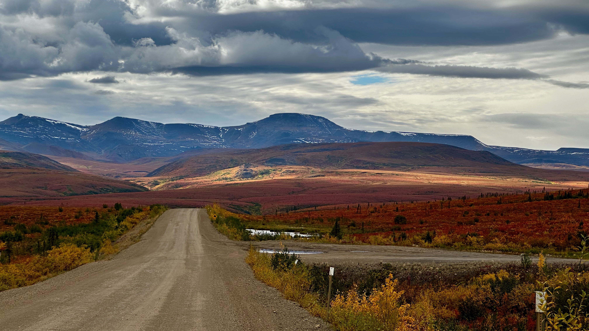

說起野馬營就必須要提到馬營，因為這個群以前是馬營的越野小群，很長時間就叫超馬群，裡面都是馬營群裡的人。至於馬營的歷史則需要師傅、院長、隊長來說了。一直到了2022年跑墨西哥之前，超馬群才開始有新鮮血液的加入，開始慢慢壯大起來，Sam、Tracy、Laura都是那個時候加入的。

## 野馬營的由來
今年9月1號，我開始了我的北極之旅。四天開了4000多公里，於9月4號到達北冰洋邊上的Tuk。4號晚上在北冰洋邊上露營，5號開始回程。當我的摩托車奔馳在北極廣袤的苔原上，滿眼的金黃色的大地一直延伸到天邊，整個天地間只有我和我的摩托車。心想不過短短几天，我就來到了如此荒野的地方，腦海裡突然蹦出了 "WILD" 這個詞，然後想到了野馬，突然意識到 "野馬營" 這個名字非常符合超馬群，而且富有深意。於是五號晚上我到達Eagle Plain的時候，在北極的苔原中，middle of nowhere，把群的名字改為了“野馬營”。

首先，野馬營體現了和馬營的淵源和傳承，只是比馬營更加 "野"。而"野" 字才是精髓所在：

- 代表我們熱愛的越野跑比賽；
- 代表我們對戶外和野外的熱愛；
- 代表這個群的特色和群成員的狂野的個性，大家都很野；
- 代表我們对待比赛的态度：像野馬一樣一往無前；
- 這個名字的誕生地本身就是在加拿大最荒野之地。

## 為什麼要一個網站
以前，大部分的溝通交流都是在微信群裡進行的。基本上每個比賽都會建一個小群，大家在裡面分享信息和照片。微信是一個實時溝通的工具，不適合沉澱信息，也不方便搜索。相比之下，網站更適合沉澱結構化、需要長期保存的信息，也更方便快速搜索。

能在茫茫人海中相遇，相聚在溫哥華，已经是難得的緣分。能跑馬拉松的人已經很少，能跑超馬的人更是少之又少，更別說能跑 UTMB、巨人之旅的人了。截止到 2024 年底，野馬營50個人裡，有10個人完成了UTMB，MT完成了巨人之旅，yong哥完賽了西部100。我常常感到驚訝，我們這樣一群特別的人，能在溫哥華這麼短的時空裡相遇。同時也很感恩遇到野馬營裡的各位朋友，和這樣一群出色的人為伍。西方有一個說法：If you hang around five millionaires, you will be the sixth. If you hang around five broke people, you will be the sixth。

天下沒有不散的筵席，總有一天大家會各奔東西，这也是我建立这个網站的最重要的原因。希望能够把我们在人生旅途中一起經歷的這段特別的時光記錄下來。希望這個網站可以記錄下我們曾經一起跑過的比賽，一起並肩在賽道上的時光。多年以後，我們依然可以回味當年那顆狂野的心！