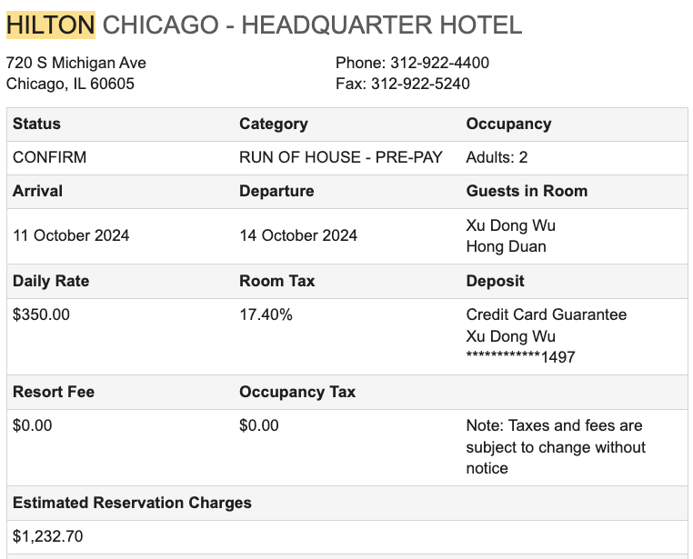

2024年芝加哥馬拉松於10月13日星期日舉行，來自肯亞的Ruth Chepngetich以2小時09分56秒的驚人成績奪得女子組冠軍，同時打破了女子馬拉松世界紀錄！這也是女子馬拉松首次突破2小時10分大關，堪稱歷史性的一刻。

這次我和兩個Eric同房，其中Eric Duan跑了245，

以下簡單總結一下這次芝加哥之行的心得和體會。

## 位置最佳的酒店
Hilton
HILTON CHICAGO - HEADQUARTER HOTEL

720 S Michigan Ave
Chicago, IL 60605
Phone: 312-922-4400
Fax: 312-922-5240

## 推薦的飯店

Hilton附近最好的中餐是明軒（Minghin Cuisine），是一家粵菜。明軒是一家連鎖店，在酒店附近走路能到達的一南一北有兩家:
1234 S Michigan Ave, Chicago, IL 60605, United States
333 E Benton Pl #300, Chicago, IL 60601, United States

## 推薦的活動

Cloud Gate
Crown Fountain
Clarence F. Buckingham Memorial Fountain

賽後的活動有很多選擇，例如去耐克旗艦店，對面四層樓的星巴克Starbucks Reserve Roastery。

DuSable Bridge邊上可以參加Wendella Tours & Cruises的遊船，購買的連結：（https://www.wendellaboats.com/Boat-Tours/chicagos-original-architecture-tour/）

印象深刻的是芝加哥的chi跑團組織的非常好，從賽前的補碳會、賽中的義工組織和賽後的相片分享都非常周到和專業。很感謝他們的辛勤付出！！